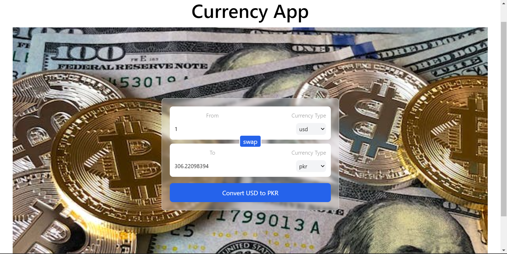

# Currency Conversion App



A simple React application for currency conversion. This app allows you to convert between different currencies using the latest exchange rates.

## Table of Contents

- [Features](#features)
- [Demo](#demo)
- [Getting Started](#getting-started)
- [Usage](#usage)
- [Contributing](#contributing)
- [License](#license)

## Features

- Convert between different currencies.
- Automatically fetches the latest exchange rates.
- User-friendly interface with currency selection and amount input.
- Swap feature to quickly switch between the "from" and "to" currencies.
- Responsive design for various screen sizes.

## Demo

You can check out the live demo of the Currency Conversion App [here](https://currency-convertor-dun.vercel.app).

## Getting Started

Follow these steps to get a copy of the project up and running on your local machine.

### Prerequisites

Before you begin, ensure you have the following installed:

- [Node.js](https://nodejs.org/) (with npm)

### Installation

1. Clone the repository:

   ```bash
   git clone https://github.com/your-username/currency-conversion-app.git
   ```

2. Change to the project directory:

   ```bash
   cd currencyConvertor
   ```

3. Install the dependencies:

   ```bash
    npm install
   ```

4. Start the development server:

   ```bash
    npm run dev
   ```

5. Open [http://localhost:3000](http://localhost:3000) with your browser to see the result.

## Usage

1. Select the currency you want to convert from in the "From" dropdown.
2. Select the currency you want to convert to in the "To" dropdown.
3. Enter the amount you want to convert in the input field.
4. The converted amount will be displayed below the input field.
5. To swap the "from" and "to" currencies, click the swap icon.
