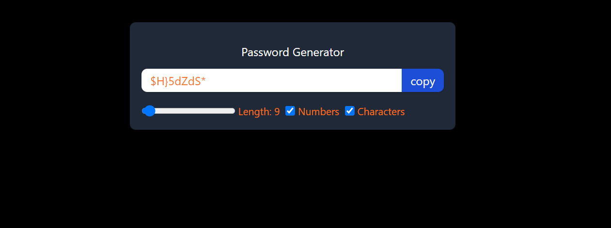

# you can visit it on

https://passwordgenerator-mu-plum.vercel.app

# Password Generator App

The Password Generator App is a React-based web application that enables users to generate secure and random passwords. This app offers a range of features for creating passwords tailored to specific requirements, including length, the inclusion of numbers, and special characters.



## Overview

In this project, I've employed several key React hooks and CSS styling techniques to create a functional and visually appealing password generator.

## Features and Technologies Used

### React Hooks

- `useState`: Used to manage state variables like `length`, `numberAllowed`, `charAllowed`, `password`, and `text` (for the button label) within functional components.
- `useEffect`: Employed to handle side effects, such as generating passwords and updating the UI, in response to changes in state variables.
- `useRef`: Utilized for accessing and manipulating DOM elements directly, specifically to manage the `password` input and the "Copy" button.
- `useCallback`: Implemented for memoizing functions like `passwordGenerator` and `copyPasswordToClipboard` to avoid unnecessary re-renders.

### CSS Styling

- A responsive and user-friendly interface is achieved using custom CSS classes. The layout is designed for optimal display on various screen sizes.
- The app features a visually appealing color scheme with a dark-themed background, which enhances readability and aesthetics.

### Functionality

1. **Password Generation**: Users can generate passwords with varying lengths (ranging from 6 to 100 characters), with options to include numbers and special characters.
2. **Password Copying**: Clicking the "Copy" button copies the generated password to the clipboard, enhancing user convenience.
3. **Button Feedback**: The "Copy" button text changes to "Copied" upon successfully copying the password, providing immediate feedback to users.

## Installation and Usage

1. Clone the repository to your local machine:

   ```bash
   git clone https://github.com/yourusername/password-generator-app.git

   ```

2. Navigate to the project directory:

   ```bash
   cd password-generator-app

   ```

3. Install dependencies:

   ```bash
   npm install

   ```

4. Start the development server:

   ```bash
   npm start

   ```

5. Access the app by opening a web browser and navigating to http://localhost:3000.

6. Use the range slider to select the desired password length and checkboxes to include numbers and special characters.

7. Click the "Copy" button to copy the generated password to the clipboard. The button briefly changes to "Copied" to confirm successful copying.
