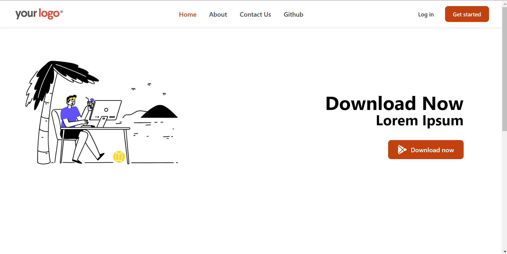

# React_Router App



## Demo

You can check out the live demo of the Currency Conversion App [here](https://react-router-seven-theta.vercel.app).

## Getting Started

Follow these steps to get a copy of the project up and running on your local machine.

### Prerequisites

Before you begin, ensure you have the following installed:

- [Node.js](https://nodejs.org/) (with npm)

### Installation

1. Clone the repository:

   ```bash
   git clone https://github.com/your-username/currency-conversion-app.git
   ```

2. Change to the project directory:

   ```bash
   cd reactRouter
   ```

3. Install the dependencies:

   ```bash
    npm install
   ```

4. Start the development server:

   ```bash
    npm run dev
   ```

5. Open [http://localhost:3000](http://localhost:3000) with your browser to see the result.
